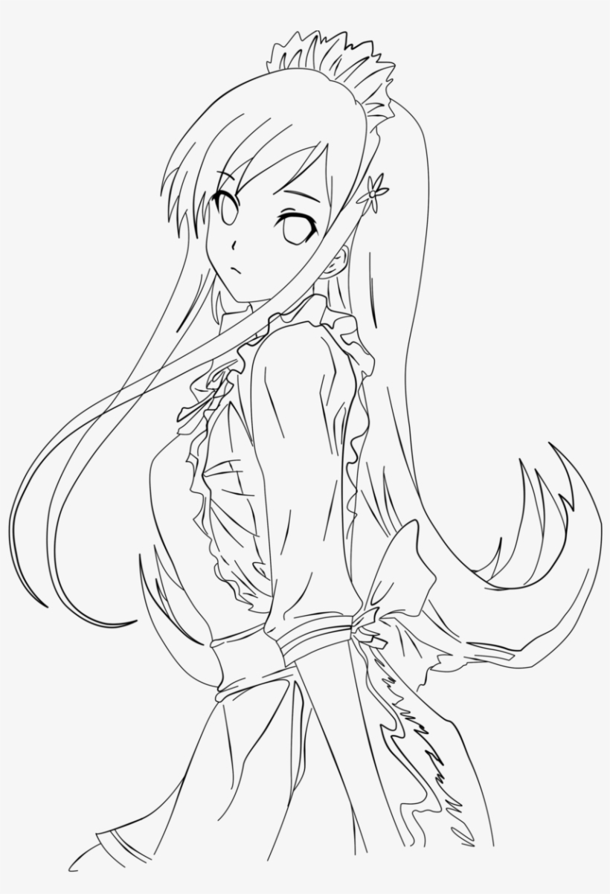

# **Art_Amp-XL: Enhanced Line Art to Artwork Transformation**

Art_Amp-XL is a powerful pipeline that enhances anime-style line art by leveraging advanced diffusion models and prompt-based instructions to produce stunningly colored and shaded images. Whether you're creating vibrant illustrations or refining shading details, Art_Amp-XL is the ideal tool for artists, designers, and enthusiasts seeking automation in their creative process.

---

## **Features**
- **Line Art to Artwork**: Convert plain line art into detailed, colored, and shaded images.
- **Customizable Outputs**: Modify colors, shading, and style using natural language prompts.
- **High Resolution Support**: Process images at resolutions up to 1024x1024 with remarkable detail.
- **Prompt-based Refinement**: Adjust the output using descriptive prompts, enhancing flexibility for creative tasks.

---

## **How It Works**
Art_Amp-XL uses a combination of **ControlNet** and **Stable Diffusion XL** models to interpret line art and generate output images based on user-provided prompts. The workflow involves:
1. **Line Art Preprocessing**: Input line art is resized and processed for compatibility with the model.
2. **Prompt-Based Control**: Users provide prompts to guide the style, color palette, and shading details.
3. **Diffusion Process**: The pipeline applies diffusion techniques to transform the line art into a fully-rendered image.
4. **Post-Processing**: The final image is refined to ensure high quality and artistic coherence.

---

## **Before and After Comparison**

Below are examples demonstrating the transformative power of Art_Amp-XL:

### **Art 1 (Enhanced shading and paint on some part of line art)**
- **Before (Line Art)**:
  
  

- **After (Colored and Shaded)**:
  
  

---

### **Art 2 (Enhanced shading)**
- **Before (Line Art)**:
  
  

- **After (Colored and Shaded)**:
  
  

---

### **Art 3 (Using Colorize prompt)**
- **Before (Line Art)**:
  
  

- **After (Colored and Shaded)**:
  
  

---

### **Art 4**
- **Before (Line Art)**:
  
  

- **After (Colored and Shaded)**:
  
  

---

## **Usage Instructions**

### **Clone the Repository**
```bash
git clone https://github.com/yourusername/Art_Amp-XL.git
cd Art_Amp-XL

follow the instruction of Art_Amp_XL.ipynb
